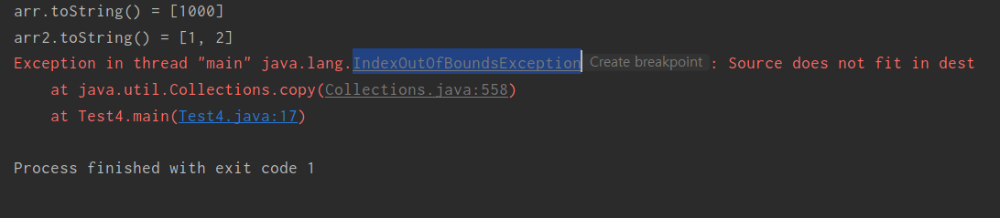

- [목차]
- [Collection](#Collection)
  - [Collection의 주요 메서드](#Collection의-주요-메서드)
- [Collections](#Collections)
  -[Collections의 주요 메서드](#Collections의-주요-메서드) 

# Collection

Collection은 인터페이스이다.
컨테이너 객체인 Collection Framework 계층의 최상위 인터페이스로 Set,List,Queue 인터페이스가 Collection 인터페이스를 구현한다.
우리가 자주 사용하는 ArrayList도 AbstractList라는것을 확장 시킨것이고 AbstractList는 List를 구현합니다.
List는 위에서 언급한것처럼 Collection을 확장 구현한것이다.

## Collection의 주요 메서드

1. size(): List에서 주로 사용되는 메서드로 size를 반환해준다.
2. add(): List에서 주로 사용되는 메서드로 Set,List,Queue같은 자료구조형에 값을 넣어주는 역할을 한다.
3. remove(): List에서 주로 사용되는 메서드로 Set,List,Queue같은 자료구조형에 값을 제거해주는 역할을 한다.
4. removeIf(): ArrayList에서 주로사용되는 메서드로 조건에 부합하는 값을 제거한다.
5. equals(): 인자로 들어온 Object가 같으면 true 다르면 false를 반환해준다.
6. hashCode(): 객체의 해시코드 값을 리턴해줍니다. HashMap같은 곳에서 사용의 편의를 위해 이용된다.

# Collections

Collections는 클래스이다.
Collections도 List,Map,Set과 가깝게 일하는 클래스로 대부분 배열의 형태로 저장되는 객체들을 위한 메서드들도 다수 존재합니다.
예시로 Collections.sort() 라는 배열 정렬 메서드는 List를 매개변수로 받고 있습니다.
이러한 관계들로 미루어 보았을때 오피셜은 아니지만 Collections는 Collection을 확장 구현하는 객체들을 편하게 사용하기 위해 클래스로 정의했다고 생각합니다.

## Collections의 주요 메서드

1.sort(): Collection을 오름차순으로 정렬한다.매개변수로는 List가 들어온다.
2.max(),min(): 배열에 있는 값들중 최대/최소값을 반환해준다.매개변수로는 Object가 들어온다.
3.shuffle(): 지정된 컬렉션의 값을 섞어준다.매개변수로는 List가 들어온다.
4.binarySearch(): 지정된 컬렉션의 값을 찾아준다.indexOf()와 동일한 기능을한다.
5.disjoint(): 두개의 컬렉션을 비교하며 같은게 있으면 true 없으면 false 반환
6.copy(): copy(dest,src)순으로 컬렉션을 넣어줘야하고 dest의 크기가 src의 크기보다 작으면 에러가 난다.밑의 예시를 보자.

```java
public static void main(String[] args) {
        ArrayList arr=new ArrayList();
        arr.add(1000);
        //arr.add(2000);
        System.out.println("arr.toString() = " + arr.toString());
        ArrayList arr2=new ArrayList();
        arr2.add(1);
        arr2.add(2);
        System.out.println("arr2.toString() = " + arr2.toString());
        Collections.copy(arr,arr2);
        System.out.println("arr.toString() = " + arr.toString());
        Collections.copy();
    }
```

해당코드는 IndexOutOfBoundsException 에러가 난다. arr의 size가 1인데 size가2인 arr2를 copy하니 사이즈 에러가난다.



에러메시지를 확인해보면 source의 크기가 dest의 크기에 맞지않다고 뜬다.

7.reverse(): 해당 컬렉션을 반대로 뒤집어 버린다.예시로 Integer형의 list에 1,2,3이 들어가있다면 3,2,1로 순서가 아예바뀐다.