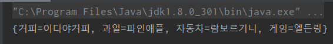
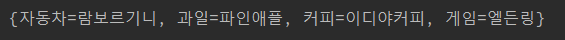
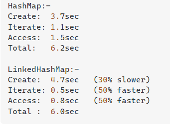

- [목차]
- [HashMap과 LinkedHashMap에 관한 정리](#HashMap과-LinkedHashMap에-관한-정리)
- [HashMap](#HashMap)
  - [HashMap의 메소드](#HashMap의-메소드)
- [LinkedHashMap](#LinkedHashMap)
- [HashMap과 LinkedHashMap의 차이점](#HashMap과-LinkedHashMap의-차이점)

# HashMap과 LinkedHashMap에 관한 정리

## HashMap
HashMap은 HashMap<?,?>형태로 생성되며 ?에는 type 또는 Object가 들어가게된다.(type생략시에는 자동으로 Object가 들어간다)
이때 들어간 순서대로 **Key,Value** 형태로 저장이 되게 되며 한쌍을 이루어 값에 저장된다.
Python언어에 있는 dictionary와 유사한 성격을 띈다.

### HashMap의 메소드

모든 메소드들에 사용되는 HashMap은 
```java
    HashMap hsm = new HashMap<String,String>();
```
형태라고 가정한다.

1. put(): hsm.put("자동차","람보르기니"); hsm.put("커피","할리스커피"); 위와 같이 Key값과 Value값을 저장한다.

2. get(): String car=(String)hsm.get("자동차"); HashMap에 저장한 Key값을 지정하면 Value값을 반환해준다.
   (생략하여 Object로 들어가게된 경우에는 Type Casting을 해줘야한다.)

3. remove: hsm.remove("커피"); key를 삭제할경우 value는 자동적으로 같이 삭제된다.

4. containsKey: hsm.containsKey("커피"); 있다면 true 없으면 false를 반환 방금 커피라는 Key를 삭제하였으니 false가 반환된다.

5. size: hsm.size(); 현재 hsm 맵에는 "자동차" 하나가 남아있기 때문에 1이 반환된다.

6. isEmpty(): hsm.isEmpty(); 맵이 비어있는지 판별해주는 메서드로서 현재 값이 있기 때문에 false가 반환된다.

## LinkedHashMap

HashMap과 메서드도 똑같고 선언도 똑같다 그럼 LinkedHashMap은 왜 HashMap의 상위호환이라고 불리며 사용되는것일까?

## HashMap과 LinkedHashMap의 차이점

우선 가장 큰 차이점은 Key의 순서가 보장되지않는다는 것이다. 이게 무슨 말인가 싶은 얘긴가 싶은 사람들을 위해 예시를 보여주겠다.

```java
        HashMap hsm=new HashMap<>();
        hsm.put("자동차","람보르기니");
        hsm.put("과일","파인애플");
        hsm.put("커피","이디야커피");
        hsm.put("게임","엘든링");
        System.out.println(hsm.toString());
```

위와 같이 HashMap에 값을 넣어주고 출력할시에 결과는 아래와 같이 값의 입력순서와 상관없이 Key 순서가 지켜지지않는다. 



반면 LinkedHashMap같은 경우 아래와 같은 코드를 작성해도 **Key가 순서대로** 저장이 되는것을 알 수 있다.

```java
        LinkedHashMap lhsm=new LinkedHashMap<>();
        lhsm.put("자동차","람보르기니");
        lhsm.put("과일","파인애플");
        lhsm.put("커피","이디야커피");
        lhsm.put("게임","엘든링");
        System.out.println(lhsm.toString());
```



이러한 문제점은 HashMap을 이용하여 채팅방에 관한 Object들을 받는다고 하였을 때 **순서가 꼬이는 문제**가 생길 수 있다.
그럴경우 LinkedHashMap을 이용하여 생성되는 방의 번호를 **순서대로 정렬**하여 사용할 수 있다.

또한 부가적인 문제로는 HashMap의 생성 속도는 LinkedHashMap 보다 빠르긴 하지만 접근속도와 반복되는경우 속도가 LinkedHashMap보다 느리다.



>출처 [StackOverFlow](https://stackoverflow.com/questions/12998568/hashmap-vs-linkedhashmap-performance-in-iteration-over-values)