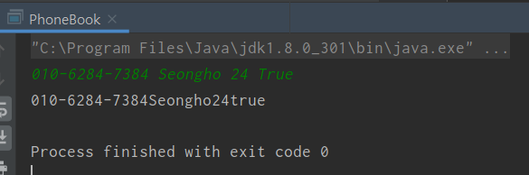
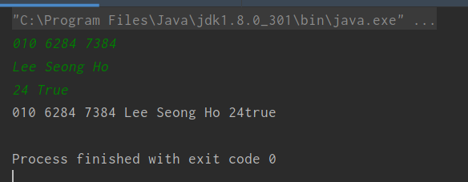
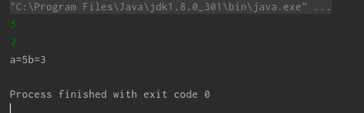
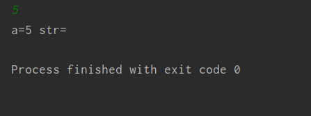
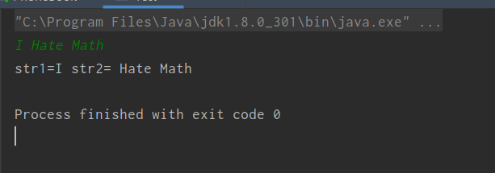

- [목차]
- [Scanner 와 BufferedReader?](#scanner-와-bufferedreader?)
- [Scanner](#scanner)
    - [Scanner의 대표적 메서드](#scanner의-대표적-메서드)
    - [Scanner 예제](#scanner-예제)
    - [Scanner 사용시 주의점](#scanner-사용시-주의점)
- [BufferedReader](#bufferedreader)
    - [BufferedReader의 대표적 메서드]
    - [BufferedReader 예제]
    - [BufferedReader 사용시 주의점]
- [Scanner와 BufferedReader의 차이]

# Scanner 와 BufferedReader?

자바언어로 프로그래밍을 진행하다 보면 Scanner나 BufferedReader를 사용하는 모습들을 볼 수 있다.
두 메서드 모두 사용자의 입력값을 받아 주는 메서드로서 이용된다.

그렇다면 무엇을 사용하는것이 훨씬 좋고 활용적인가에 대하여 고민될것이다. 
이 둘의 차이를 비교하여보고 활용적인 측면에 무엇이 더 유용한가를 알아보자.

## Scanner
* Scanner는 **JDK 1.5** 버전에 출시된 메서드로서 정수값 int,shor,long,소수값 float,double을 구분지어 읽어들일 수 있고
String 값 또한 읽을 수 있다.

* 하지만 버퍼의 크기가 (1KB)로 작은편에 속하여 입력받는 내용이 작을경우에 사용된다.

* 가장중요한 점 중 하나인 정규식 파싱과 동기화에 대하여 얘기하여 보자.

* Scanner는 위에서 말하였듯이 정규식 표현들을 읽어들일 수 있어 **nextInt(),nextLong(),nextShort,nextFloat()**과 같이 파싱이 가능하다.

* Scanner는 동기화를 사용하지않는다. 이 말은 즉 여러 스레드를 이용하는 것이 아닌 Single Thread만을 이용한다는것이다.

* Scanner 클래스는 입력값을 **토큰단위**로 읽어들인다.(단,nextLine() 메서드를 이용할 때는 얘기가 다르다)
토큰: 공백문자로 구분되는 요소
* Scanner는 값을 입력받을 때 공백문자를 버리지않는다.Spacebar,Enter,Tab로 생긴 모든 공백문자들은 버퍼에 저장되고 내가 다른곳에서 읽어들이기
전까지 버퍼에 잔류해있는다.

### Scanner의 대표적 메서드 

1. next(): String을 읽는다. 공백뒷부분은 읽어내지않는다.
2. nextLine(): String을 한줄단위로 읽어낸다.(사용자가 Enter입력 전까지) **값 입력시 주의해야할 점이 있다**
3. nextInt(): int형의 값을 읽는다.
4. nextBoolean(): boolean형의 값을 읽는다.
5. nextLong(): long형의 값을 읽는다.
6. nextFloat(): float형의 값을 읽는다.
7. nextDouble(): double형의 값을 읽는다.

### Scanner 예제

* 토큰단위로 읽어들이기(단,nextLine()은 Enter를 구분자로 잡기에 토큰단위로 읽어들이지않는다.)
```java
import java.util.*;

public class PhoneBook{
    public static void main(String[] args){
        Scanner scanner= new Scanner(System.in);
        
        String phoneNumber=scanner.next();
        String name=scanner.next();
        int age=scanner.nextInt();
        boolean myFriend=scanner.nextBoolean();

        System.out.println(phoneNumber+name+age+myFriend);
        
        scanner.close();
    }
}
```
=> 실행결과


토큰단위로 읽어들이기 때문에 공백을 주어 입력을 하여도 공백은 지워지고 버퍼에 저장된다.
Scanner메서드에 각 토큰들이 순차적으로 들어가는것을 볼 수 있다.

* nextLine의 경우
```java
import java.util.*;

public class PhoneBook{
    public static void main(String[] args){
        Scanner scanner= new Scanner(System.in);

        String phoneNumber=scanner.nextLine();
        String name=scanner.nextLine();
        int age=scanner.nextInt();
        boolean myFriend=scanner.nextBoolean();
        
        System.out.println(phoneNumber+name+age+myFriend);

        scanner.close();
    }
}
```
=> 실행결과

nextLine()메서드는 String형의 데이터를 입력받기 때문에 int형이나 boolean형은 지원이 안되는것을 볼 수 잇지만
String 형의 데이터는 Enter전까지 공백을 주어도 그대로 버퍼에 저장이되는것을 볼 수 있다.

### Scanner 사용시 주의점

* Scanner 메서드 사용시 가장 주의해야할점은 nextLine() 메서드의 성질이다.

nextLine 메서드와 일반적인 메서드와는 차이점이 존재한다.

1. **nextLine()** 메서드는 **Enter**단위로 읽고, 나머지 메서드는 **토큰(Token)** 단위로 값을 읽는다.
2. 입력값을 읽어들일때 **nextLine()** 은 **\n** 을 포함해서 읽지만 나머지 메서드는 공백문자를 **제외**하여 읽어들인다.
3. 반환시에 **nextLine()** 메서드는 **\n**을 버려서 **return**하고 나머지 메서드는 입력시에 제외하니 반환값도 제외되어 return한다.

* nextLine()을 제외한 메서드에서 공백이 남아있는 경우 버퍼에는 분명 저장되어있다고 했다. 그렇다면 공백이 들어간후 값을 읽어들이면?
  (a에는 5\n(spacebar)가 들어간다.)
```java
 import java.util.*;

public class Test {
    public static void main(String[] args){
        Scanner scanner=new Scanner(System.in);

        int a=scanner.nextInt();
        int b=scanner.nextInt();

        System.out.println("a="+a+"b="+b);
    }
}
```
=> 실행결과


공백을 제거해버리는 메서드들 끼리는 이상이 없이 출력이 잘되는 모습이다.
그렇다면 공백을 읽어버리는 nextLine() 메서드는?

```java
import java.util.*;

public class Test {
    public static void main(String[] args){
        Scanner scanner=new Scanner(System.in);

        int a=scanner.nextInt();
        String str=scanner.nextLine();

        System.out.println("a="+a+" str="+str);
    }
}
```
=> 실행결과


위와 같이 a에는 5\n(spacebar)값을 주었더니 \n(공백)을 읽어들이는 nextLine()메서드는 버퍼에 남아있는 \n값을 nextLine()이 이를 읽게되고
Enter단위로 값을 받기 때문에 값을 입력받은거로 처리되어 공백문자가 들어가 버리게된다. 이를 응용하여 다른 문제점도 보자.

```java
import java.util.*;

public class Test {
    public static void main(String[] args){
        Scanner scanner=new Scanner(System.in);

        String str1=scanner.next();
        String str2=scanner.nextLine();

        System.out.println("str1="+str1+" str2="+str2);
    }
}
```
=> 실행결과

이와 같이 I를 제외한 문자열이 버퍼에 남아 다른 값을 입력하려해도 버퍼에 남아있는 값이 들어가게된다.
이를 바탕으로 nextLine()메서드를 다른 메서드들과 혼합하여 사용시에 주의해야 할점이 생긴다.

## BufferedReader

* BufferedReader는 JDK1.1 버전에서 출시된 메서드로서 메서드명처럼 버퍼를 읽고 쓰는 함수이다.

* 버퍼를 사용하기 때문에 이 함수를 사용할시에 입출력의 효율이 좋아지는 장점이있다.(하드웨어적 부분에서도 이득이 많이있다.)