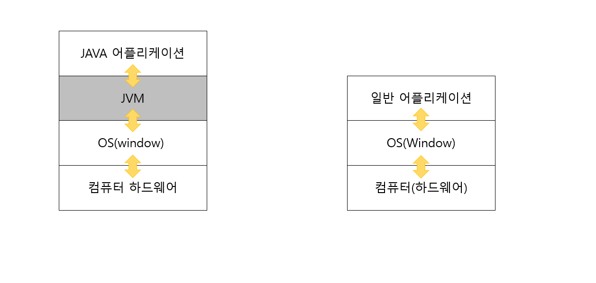

# 자바(JAVA Programming Language)
## 자바란?
* 자바는 객체지향언어로서 현재까지 이용되고 있는 프로그래밍 언어중하나이다. 

자바의 가장 중요한점은 운영체제에 독립적이기에 환경의 영향을 받지않음으로 인터넷 환경에 적합한 언어로 많은 사용자 층을 확보하였다.
객체지향개념을 설립하고 C++과 같은 기존언어의 장점만을 가져와 발전시키고 다양한 JAVA API를 이용하여 개발자 입장에서 배우기 쉽고 편리하다.

## 자바언어의 특징

1. 운영체제에 독립적이다.

=> 자바응용프로그램은 운영체제나 하드웨어와 통신하지않고 JVM(자바의 에뮬레이터)과 통신하여 이를 JVM이 해당 운영체제가 이해하도록 변환시킨다.
   (고로 자바로 작성된 자바응용프로그램은 운영체제에 독립적이지만 JVM은 운영체제에 종속적이게된다.)

2. 객체지향언어이다.

=> 객체지향개념의 특징들인 상속,캡슐화,다형성이 적용된 순수한 객체지향프로그래밍언어이다.

3. 타언어에 비하여 배우기 쉽다.

4. 자동 메모리 관리(Garbage Collection,가비지 컬렉터)

=> 프로그래밍에 있어서 사용하지않는 메모리를 체크,반환하는 것은 중요하다.이를 대부분 수동으로 처리하지만 자바는 가비지 컬렉터가 자동처리해준다.
   (이는 다소 비효율적일 수 있어도 프로그래밍에 집중할 수 있도록 도와주기에 장점으로 생각한다.)

5. 네트워크와 분산처리를 지원한다.

=> 다양한 네트워크 프로그래밍 라이브러리를 통해 비교적 짧은 시간에 네트워크 관련 프로그래밍을 비교적 쉽게 개발가능하게 지원해준다.

6. 멀티쓰레드 지원

=> 환경과 관계없이 멀티쓰레드 구현이가능하며 관련 라이브러리 또한 제공되어 구현이 쉬우며 쓰레드에 대한 스케줄링을 자바 인터프리터가 담당한다.

7. 동적 로딩(Dynamic Loading)을 지원한다.

=> 자바의 가장중요한 장점이라고 생각되는 부분 중 하나이며 여러개의 클래스로 구성되어있는 자바프로그램의 특성상 동적로딩이 지원되어 어플리케이션
   실행시에 모든 클래스가 로딩되지않고 필요한 클래스만 로딩하여 사용하며 클래스가 변경되어도 전체를 컴파일하지않고 유연하게 처리 할 수 있다.

## JVM(JAVA Virtual Machine)
* JVM은 JAVA Virtual Machine, 직역하면 자바를 실행하기 위한 가상 기계이다. 자바로 작성된 어플리케이션은 모두 JVM에서만 실행된다.

일반적인 어플리케이션의 코드들은 OS를 거쳐 바로 하드웨어로 전달된다. 하지만 자바는 JVM을 한번더 거치기 떄문에 하드웨어에 맞게 컴파일 하지않고
실행시 해석(interpret)되기 떄문에 속도가 느리다는 단점이 있다. (하지만 최근 JTT컴파일러와 향상된 최적화 기술로 속도의 격차를 많이 따라잡았다)

위 사진과 같이 일반 어플리케이션은 OS와 맞붙어 OS의 종속적이며 다른 OS에서 실행시에는 어플리케이션을 OS에 맞춰 수정해야하는 문제점이 있었다.
반면 JAVA 어플리케이션은 JVM과 소통하기 때문에 OS나 하드웨어에 종속적이지 않고 다른 OS환경에서도 실행가능하다.(자바가 사랑받은 이유라 생각한다)
단, JVM은 OS에 종속적이므로 해당 OS에 맞는 JVM설치가 필요하다.

## 자바에서 자주발생하는 에러와 해결방법

1. cannot find symbol 또는 cannot resolve symbol

=> 지정된 변수,메서드를 찾을 수 없다는 뜻 으로 변수나 메서드를 선언하지않았거나 잘못사용한 경우에 발생

2. ';'excepted

=> 세미콜론이 문장의 끝에 빠져있을 때

3. Exception in thread "main" java.lang.NoSuchMethodError : main.

=> 클래스내에 main 메서드가 존재하지 않는경우 또는 public static void main(String[]args)에 오타가 있는경우 이다.

4. NoClassDefFoundError

=> 해당 클래스를 찾을 수 없을때 이다. 클래스명이나 파일 생성여부를 확인해보아야한다.

5. illegal start of expression

=> 수식 또는 문법이 틀렸을때 이다. 대부분 괄호를 닫지않거나 if,for 문법에 문법적오류가 있을 때 생기는오류이다.

6. class,interface or enum expected 

=> 보통 괄호의 개수가 일치하지않을경우 나는 에러이다.

* 개발자로서 마주했을 때 가장 두려운것은 오류이다.하지만 오류 또한 그냥일어나는것이 아니기에 흔적을 따라 분석하여 고치는연습이 필요하다. 
