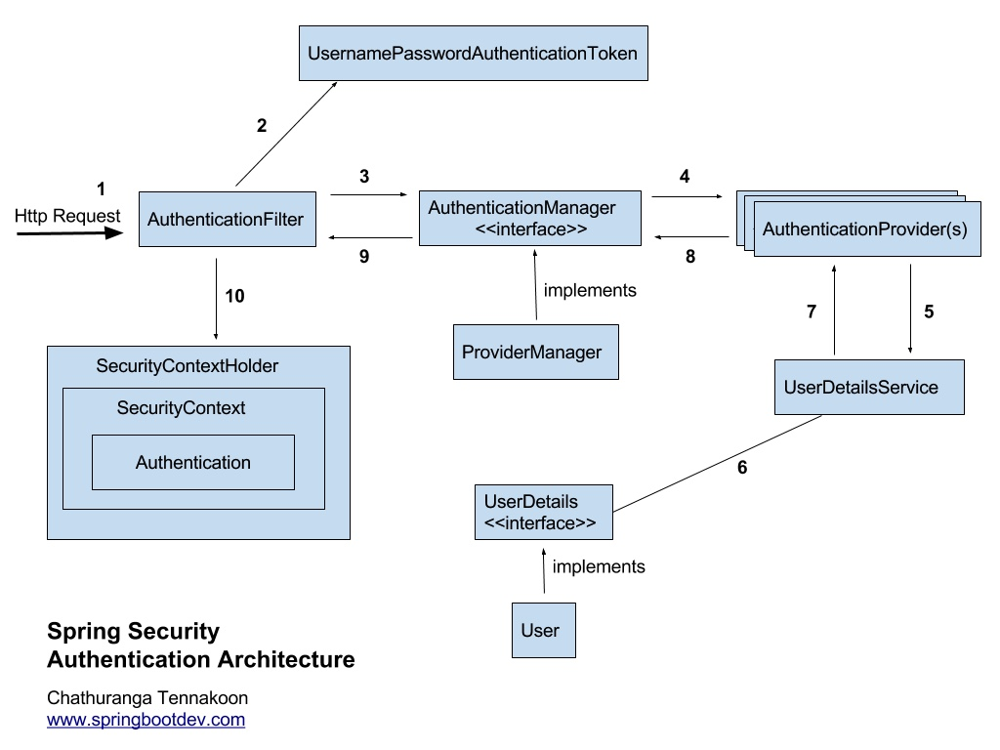

# SpringSecurity와 Jwt

## SpringSecurity

SpringSecurity는 사용자에 대한 인증 및 접근 권한을 제어할 수 있는 프레임워크이다.
기존에 제공되는 여러 필터들이 존재하며 개발자가 원한다면 필터를 커스터마이징 할 수 있다.

## SpringSecurity 기본개념

* '인증(Authentication)은 주체(Principal)의 신원(Identify)을 증명하는 과정이다'
> 출처 [Spring 5 레시피]

이 말의 뜻을 해석해보자.
**주체는 사용자**를 뜻하며 주체는 자신의 **신원**을 인증받기 위해 **Credential**을 제시한다. 여기서 유저의 Credential은 대부분 회원가입에 사용되었던 패스워드이다.
신원을 인증받게 된다면 사용자에게 **권한**이 부여된다. 이를 통하여 부여받은 **권한의 범위 내**에서 특정 리소스들을 접근 할 수 있다.
이를 통틀어 **인가(Authorization)** 라고 칭한다. 인가는 인증후에 이루어지며 대부분 권한은 ROLE 형태로 부여한다.(GUEST,USER,MEMBER,ADMIN)

위에서 말한 듯이 권한이 부여되면 권한의 범위 내에 해당하는 특정 리소스에만 접근이 가능하며 권한이 없는 리소스에 접근 시 접근통제가 일어난다.

## FilterChain

SpringSecurity는 표준 서블릿 필터를 사용하며 서비스 설정에 따라 필터를 내부적으로 구성한다. 각 필터는 역할이 다르게 존재하며
필터 사이의 종속성이 있어 순서가 중요하다. jwt를 사용할 경우 필터를 커스터마이징하여 명시적으로 빈에 등록을 해주어야한다.
Spring Security FilterChain에는 다양한 필터들이 존재한다.

1. SecurityContextPersistentFilter : SecurityContextRepository에서 SecurityContext를 가져와서 SecurityContextHolder에 주입하거나 반대로 저장하는 역할을 합니다.

2. LogoutFilter : logout 요청을 감시하며, 요청시 인증 주체(Principal)를 로그아웃 시킵니다.

3. UsernamePasswordAuthenticationFilter : login 요청을 감시하며, 인증 과정을 진행합니다.

4. DefaultLoginPageGenerationFilter : 사용자가 별도의 로그인 페이지를 구현하지 않은 경우, 스프링에서 기본적으로 설정한 로그인 페이지로 넘어가게 합니다.

5. BasicAuthenticationFilter : HTTP 요청의 (BASIC)인증 헤더를 처리하여 결과를 SecurityContextHolder에 저장합니다.

6. RememberMeAuthenticationFilter : SecurityContext에 인증(Authentication) 객체가 있는지 확인하고 RememberMeServices를 구현한 객체 요청이 있을 경우, RememberMe를 인증 토큰으로 컨텍스트에 주입합니다.

7. AnonymousAuthenticationFilter : 이 필터가 호출되는 시점까지 사용자 정보가 인증되지 않았다면 익명 사용자로 취급합니다.

8. SessionManagementFilter : 요청이 시작된 이후 인증된 사용자인지 확인하고, 인증된 사용자일 경우 SessionAuthenticationStrategy를 호출하여 세션 고정 보호 매커니즘을 활성화 하거나 여러 동시 로그인을 확인하는 것과 같은 세션 관련 활동을 수행합니다.

9. ExceptionTranslationFilter : 필터체인 내에서 발생되는 모든 예외를 처리합니다.

10. FilterSecurityInterceptor : AccessDecisionManager로 권한부여처리를 위임하고 HTTP 리소스의 보안 처리를 수행합니다.

##Spring Security의 구조

사진의 흐름에 맞추어 설명을 해보겠다.

1. 사용자가 로그인 창(로그인 페이지를 따로 작성하지 않아도 위에서 언급한 DefaultLoginPageGenerationFilter에서 자동생성하여 준다)에서 입력한 사용자 정보로 인증을 요청한다.

2. AuthenticationFilter는 이 정보를 바탕으로 UsernamePasswordAuthenticationToken 사용자 인증용 객체를 생성한다.

3. 필터는 요청을 처리하고 AuthenticationManager의 구현체 ProviderManger에 인증요청과 사용자 인증용 객체를 전달한다.

4. AuthenticationManager는 검증을 위해 AuthenticationProvider에게 인증요청과 사용자 인증용 객체를 전달한다.

5. DB에 담긴 사용자 정보와 비교를 위해 UserDetailService에 사용자 정보를 넘겨준다.

6. DB에서 찾은 사용자 정보를 바탕으로 UserDetails 객체를 생성한다.

7. AuthenticationProvider는 UserDetails와 자신이 받은 정보를 비교한다.

8. 만약 정보가 일치한다면 권한을 부여한 사용자 정보 객체를 반환한다.

9. 최초의 AuthenticationFilter에 인증 정보를 전달한다.

10. 이 인증 정보를 SecurityContext에 저장한다.

## JWT(Json Web Token)

JWT는 앞서말한 인가, 즉 사용자 정보를 인증하고 권한을 부여하기위해 클라이언트와 서버 또는 서비스와 서비스사이에 이용된다.

JWT는 Header,Payload,Signature로 구성된다. 이해가 어렵다면 곤충의 머리 가슴 배로 이해하면된다.

Header에는 토큰의 타입과 해싱 알고리즘이 저장된다. 해싱 알고리즘이란 데이터의 전송중 중간에서 개입하여 추출하였을 경우 원문을 추정하기 어렵게 하기위한 기술이다.
쉽게말하자면 데이터를 변조시켜 전송하는 데이터의 값을 모르게 하기 위한 알고리즘이다. 그만큼 중요함으로 곤충의 머리와 똑같다고 생각하면 된다.

Payload에는 실제 전달하고자하는 값이 담겨있다. 이는 헤더의 해싱 알고리즘에 의해 보낼때 암호화 받을 때 복호화된다.

Signature에는 값의 위조와 변조를 막기위한 값이 들어간다.

