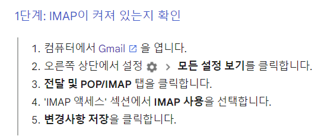

# SMTP를 이용한 메일전송

최근 Spring boot환경에서 가장 보편적으로 사용가능한 메일전송 구조체인 JavaMailSender를 사용하는 과정에서
메일 설정과 관련하여서 에러가난다. 

 

해당 사진처럼 에러에 제공되는 링크 접속시에 서비스 로직문제라기 보단 Gmail의 보안 스펙사항이 변경된것으로 보인다.

해당절차들을 해결해준다면 구글에서 제시하는 보안 스펙 기준을 맞춰 서비스가 이용가능하게 된다.
**하지만 여기에서도 문제가 될경우** 

수신/발신 서버의 스펙을 다시한번 확인해보자.
본인의 경우 현재진행중인 프로젝트에서 이메일 인증 로직구현이 필요하였고 그로 인해서 수신 서버는 필요하지않으므로 발신 서버만 구현하였다.
또한 Spring-boot 프로젝트에 관련한 설정파일은 application.yml 파일로 
메일에 관한 설정파일은 **mail.yml** 파일로 따로 **분리**하여 관리에 용이하게 하였다.

