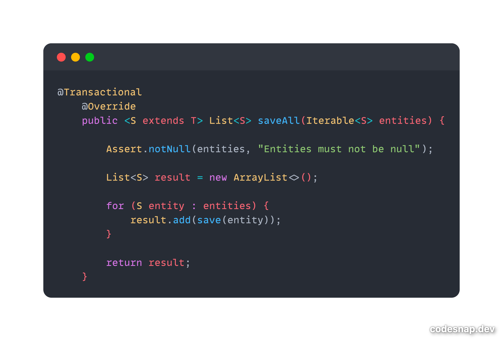

# Spring JDBC - batchUpdate() 사용한 bulk Insert(벌크연산) 최적화

Spring Data JPA를 사용할 때 10,000건 혹은 100,000건의 대규모 데이터를 저장하려면 어떻게 해야할까?

단순 계산으로만도 생각을 해보았을 때, 엔티티 1 : insert 쿼리 1의 방식을 서버에 부담시킨다고 가정하면 그 부하는 상상하기 힘들것이다.

우리는 이러한 부분을 개선하기 위한 방법으로 jdbc에서 설정값으로 제공하는 batch_size를 사용하는 법도 있지만 JDBC를 이용하는 Case를 소개하고자한다.

## Bulk Insert
우선 벌크연산이란 무엇일까? 데이터베이스에서 한번에 여러 데이터를 처리하는 작업을 말한다. 보통 삽입,수정,삭제 작업에 사용된다.
한마디로 한번의 쿼리로 대량의 데이터를 처리하는 것이다.

기본적으로 3건의 삽입(insert) 쿼리를 처리한다고 가정하면 아래와 같은 쿼리를 떠올릴 것이다.

**일반쿼리**
```sql
INSERT INTO table1 (col1, col2) VALUES (val11, val12);
INSERT INTO table1 (col1, col2) VALUES (val21, val22);
INSERT INTO table1 (col1, col2) VALUES (val31, val32);
```

**batch insert**
```sql
INSERT INTO table1 (col1, col2) VALUES
(val11, val12),
(val21, val22),
(val31, val32);
```

batch insert가 일반적인 insert에 비해 훨씬 효율적임을 쉽게 알 수 있다

## JPARepository vs JDBCTemplate
Spring Data JPA 환경에서는 사실 이러한 상황을 대비한 `saveAll()`이라는 메서드가 존재한다.



하지만 위를 보면 알 수 있듯이 saveAll의 경우 for문을 통한 loop를 수행하며 save하는 로직을 수행하기에, 
개발자가 saveAll이라는 메서드를 이용하지않고 loop를 돌며 save메서드를 사용하는 것에 비해 드라마틱한 성능차이를 기대할 수는 없으며 성능적으로도 좋은 효과를 보지 못한다.

그렇기에 JDBCTemplate의 batchUpdate를 이용하여, 쿼리 효율성을 높여주게 되면 더 빠른 실행속도를 보장받을 수 있디.

**savaAll() 성능지표**


**batchUpdate() 성능지표**
