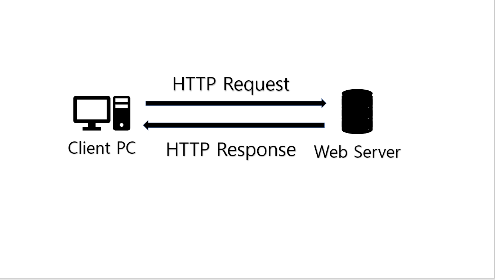
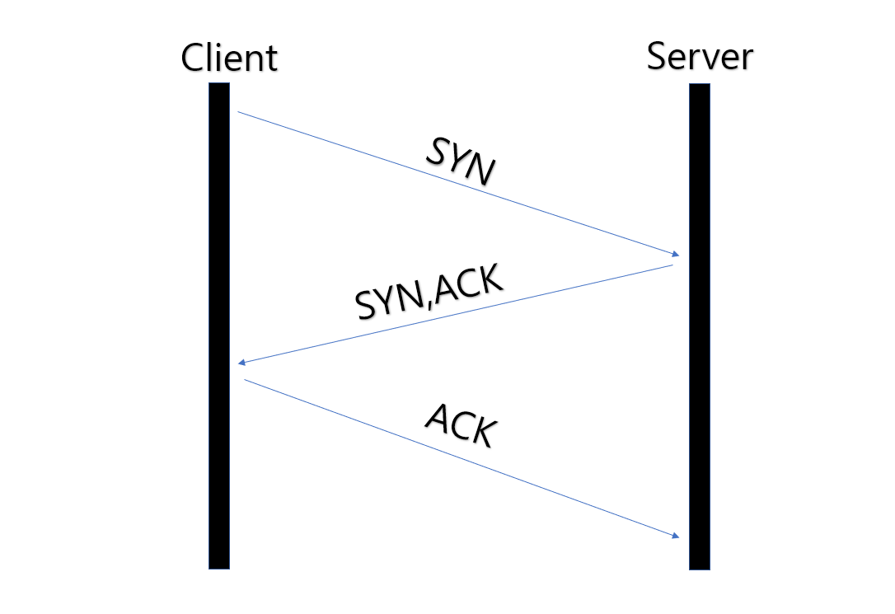
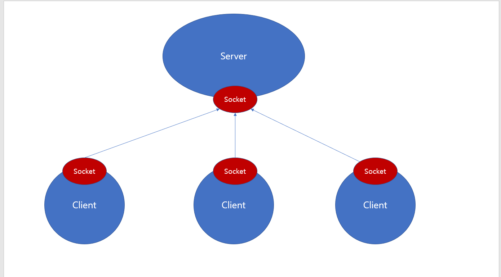

# Web-Socket과 Web-RTC(웹소켓을 활용한 채팅방 구성중 알게된 사실)

- [목차]
- [기존 HTTP의 동작 개념과 원리](#기존-HTTP의-동작-개념과-원리)
- [Web-Socket의 등장](#Web-Socket의-등장)
- [Web-Socket 서버](#Web-Socket-서버)
- [Web-RTC는 무엇인가](#Web-RTC는-무엇인가)

## 기존 HTTP의 동작 개념과 원리

기존의 HTTP 통신방식은 클라이언트의 request(요청)을 받은 웹 서버가 Response(응답)를 보내주는 방식입니다.
클라이언트가 브라우저를 통하여 특정 페이지를 요청(request)하면 페이지를 구성하는 모든 요소를 서버가 보내줍니다.

이때 클라이언트의 request가 없다면 웹 서버에서 직접적으로 클라이언트 쪽으로 구성요소와 정보들을 보낼 수는 없습니다.
또한, request-response라는 하나의 사이클이 끝나게되면 브라우저 - 서버의 통신은 끝납니다.

이러한 HTTP 통신방식으로 채팅을 구현하게 된다면 상대방의 메시지를 읽기위해서 양쪽의 클라이언트 모두가 매번 새로고침을 통하여
서버에 request와 response를 무수히 요청하게됩니다. 
**이말은 즉, HTTP통신은 실시간 통신에는 한계가 명확하게 보인다**라고 해석할 수 있습니다.

HTTP에서도 이를 최대한 개선하기 위해 Polling이라는 기술 스펙을 도입하였지만 문제점이 명확했습니다.
Polling은 일정 주기로 서버에 request를 보내는형식인데 이로인해 불필요한 request와 커넥션이 생기게됩니다.
이를 개선하기 위해 Load Polling이라는 기술도 사용되었습니다. 이벤트가 발생하는 경우에만 서버에서 response하는 방식입니다.
하지만 이역시도 커넥션이 많아지면 Polling과 동일한 문제가 생기게됩니다.

## Web-Socket의 등장

웹 소켓은 이러한 HTTP의 명확한 한계점을 극복하기 위해서 등장했습니다.
기존의 Request-Response 사이클로 통신을 하던 구조대신 커넥션이 Open-Close 되어있는지를 체크합니다.
브라우저가 서버와 통신을 Open한 경우에는 **양방향 통신**이 가능합니다. 또한 직접적으로 Close하기 전까지는 통신이 유지됩니다.

다만 웹 소켓도 최초 접속시에는 HTTP 프로토콜 위에서 *핸드쉐이킹을 합니다.

웹 소켓에서는 브라우저 서버 둘다 메시지를 보내고 받을 수 있습니다. 따라서 서버는 브라우저의 request를 기다리지 않고 업데이트된 요소가 있다면
브라우저에 바로 전달합니다.

이러한 장점으로 인해 **암호화폐 거래소,게임,채팅**등에서 활발하게 이용됩니다.

핸드쉐이킹:클라이언트와 서버간의 동기화하여 사용하기위함으로 클라이언트가 최초 동기화요청,서버에서 응답및 동기화 마지막으로 클라이언트 사용순이다.

## Web-Socket 서버

우리가 흔히 말하는 단체톡방 같이 여러 Client가 통신을 하게되면 많은 인원 Client와 직접적으로 통신을 하는것이 아닙니다.
위의 그림과 같이 공통의 웹 소켓에 입장하여 메시지를 서버에 전달하면 서버쪽에서 다시 Client에게 전달해주게됩니다.

이 경우에는 웹 소켓 서버의 성능이 상당히 중요해지는데 실시간 통신처럼 데이터를 커넥션에 연결된 사람들에게 바로 포워딩해야하기 떄문입니다.
그럴경우 서버에 들어가는 비용은 늘어나고 서버에 접속하는 Clinet수가 증가할경우 딜레이가 생겨 서버에 부하가 가해지게 됩니다.
또한 서버가 다운(종료)되게 된다면 모든 통신은 종료되게됩니다.

## Web-RTC는 무엇인가

WebRTC(Web Real Time Communication)란 중간에 서버를 두지않고 클라이언트들의 브라우저가 직접 연결되는것을 말합니다.
쉽게말해 크롬이나 웨일같은 브라우저하나로 별도의 소프트웨어 설치가 필요가없어지고 데이터 교환이가능합니다.
이를 이용해 화상회의 프로그램이나 실시간스트리밍,스크린공유같은 서비스가 탄생되었습니다.

WebRTC는 서버를 통하지않기 때문에 속도가 더빠르고 WebSocket의 단점을 보완했습니다.

> 출처 [블로그](https://velog.io/@alstjdwo1601/Web-Socket-%EA%B3%BC-WebRTC)
> 출처 [블로그](https://velog.io/@wldus9503/%EB%84%A4%ED%8A%B8%EC%9B%8C%ED%81%AC-Network3.-WebSocket-%EC%9B%B9-%EC%86%8C%EC%BC%93%EC%97%90-%EB%8C%80%ED%95%B4%EC%84%9C)
> 출처 [블로그](https://ohgyun.com/436)
> 출처 [블로그](https://wormwlrm.github.io/2021/01/24/Introducing-WebRTC.html)
