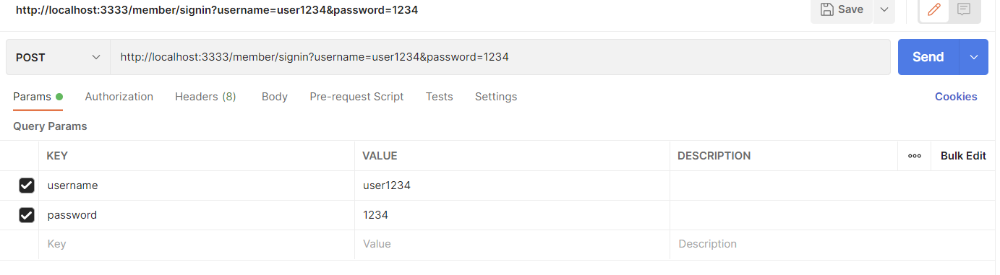

# 스프링 시큐리티에서 FormLogin 방식을 이용할 때 볼 수 있는 UsernamePasswordAuthenticationFilter에서 나는 에러에 관하여

* 스프링 시큐리티에 관한 자세한글은 아래 링크를 참조하기 바란다.
> 출처 [seonghoo1217's TIL](https://github.com/seonghoo1217/TodayILearnd/blob/main/Spring-boot/SpringSecurity/SpringSecurity%EC%99%80%20Jwt.md)

* 해당 글은 학교 졸업작품 구현중 리액트와 스프링 서버간의 API 확인중 로그인 API에서 발생한 문제를 겪고 구글링을 통한 공부를 거쳐 정리한 글이다.

우리는 대부분 스프링 시큐리티를 사용하면 formLogin 방식을 사용하여 스프링 시큐리티에 로그인 처리를 맡기게된다.

formLogin의 진행방식은 다음과 같은 방식으로 인증(Authentication)이 진행된다.

위에 사진처럼 formLogin방식에 POST로 요청을 보내게되면 요청은 순서대로 LogoutFilter 이후에  AbstractAuthenticationProcessingFilter를 호출하며
그 이후에 AbstractAuthenticationProcessingFilter에서 인증(Authentication)을 진행한다.

그다음 인증을 진행하기위해 requiresAuthentication를 통해 인증의 필요성을 체크한후 requiresAuthenticationRequestMatcher의 matchs를 호출한다.
matches는 스프링 시큐리티 즉, WebSecurityConfigurerAdapter 를 상속받아 우리가 구현할때 사용하는 AntPathRequestMatcher가 사용된다.

또한 우리는 POST요청을 통해 API를 실행시키기 때문에  requiresAuthentication을 통과한후 다음으로는 attemptAuthentication이 실행되며 Authentication 객체를 반환한다.
attemptAuthentication은 추상 메서드로, AbstractAuthenticationProcessingFilter를 구현한 클래스에서 이를 구현해서 사용하게 되는데 이때 사용되는게
UsernamePasswordAuthenticationFilter이다.

여기서 UsernamePasswordAuthenticationFilter를 살펴보게되면 username과 password는 반드시 파라메터 형태로 가지고 있어야하고 이를 가지고
UsernamePasswordAuthenticationToken을 생성한다. 또한 이 토큰을 사용하여 Authentication 객체를 반환한다.

그렇기 때문에 커스텀하지않고 JSON형식의 데이터를 바디에담아 요청할 경우 Filter에서 인자값이 주어지지않아 에러를 내던것이었다.
