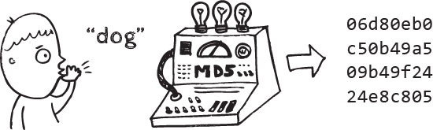
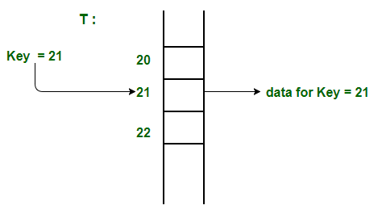
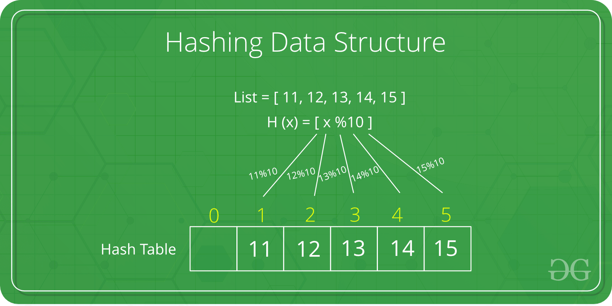

# HashTable 과 HashMap과의 차이

## 해싱의 정의(Hashing)
* 해싱이란 임의의 길이의 값을 해시 함수를 사용하여 고정된 크기의 값으로 변환하는 작업

위 그림에서 dog 라는 문자열을 해시함수를 이용해 새로운 값으로 변환한 것을 볼 수 있는데 이 경우엔 암호화에 쓰이는 해시 알고리즘인 MD5를 사용한 것이다.
하지만 여기서 다룰 것은 암호화에 쓰인 방식이 아닌 자료구조로 사용하고자 하는 해시 테이블을 다루기 때문에 정수값으로 변환되는 해시 알고리즘을 사용한다.
해싱을 사용하여 데이터를 저장하는 자료구조를 해시 테이블(Hash Table)이라고 하며,
이는 기존 자료구조인 이진탐색트리나 배열에 비해서 굉장히 빠른 속도로 **탐색, 삽입, 삭제**를 할 수 있기에 많은 분야에서 사용된다.

## 해시 테이블(HashTable)
* 해시 테이블이란 해시 함수를 이용하여 변환한 값을 index 삼아 Key와 Value를 저장하는 자료구조이다.
* 기본연산으로 탐색,삽입,삭제가 존재한다.

### 해시 테이블 종류

1. Direct Address Table

=> 먼저 가장 간단한 형태의 해시테이블로 이름 뜻대로 키 값을 주소로 사용하는 형태의 테이블이며, 키값이 100일 경우 배열의 100번째 인덱스에 데이터를 저장한다.

위 그림에선 키 값이 21였기 때문에 인덱스 21에 원하는 데이터를 저장한 경우이다. 이러한 자료구조는 탐색,삽입,삭제 연산을 모두 O(1)O(1) 에 할 수 있지만 다음과 같은 한계점이 있다.

### Direct Address Table의 특성
- 최대 키 값에 대해 알고 있어야 한다.
- 최대 키 값이 작을 때 실용적으로 사용할 수 있다.
- 키 값들이 골고루 분포되어있지 않다면 메모리 낭비가 심할 수밖에 없다.

2. HashTable

해시함수를 사용하여 특정 해시값을 알아내고 그 해시값을 인덱스로 변환하여 키 값과 데이터를 저장하는 자료구조이다. 
이는 보통 알고 있는 해시 테이블을 얘기하며 개념자체가 어려운 것은 아니지만 문제가 되는 것은 **충돌(Collision)이다**.
충돌에 대해서 이해하기 위해선 먼저 **적재율**(Load Factor)에 대해서 이해해야 한다.

적재율이란 해시 테이블의 크기 대비, 키의 개수를 말한다. 즉, 키의 개수를 KK, 해시 테이블의 크기를 NN 이라고 했을 때 적재율은 K/NK/N 이다.
Direct Address Table은 키 값을 인덱스로 사용하는 구조이기 때문에 적재율이 1 이하이며 적재율이 1 초과인 해시 테이블의 경우는 반드시 충돌이 발생하게 된다.

만약, 충돌이 발생하지 않다고 할 경우 해시 테이블의 탐색, 삽입, 삭제 연산은 모두 O(1)O(1) 에 수행되지만 충돌이 발생할 경우 탐색과 삭제 연산이 최악에 O(K)O(K) 만큼 걸리게 된다.
이는 같은 인덱스에 모든 키 값과 데이터가 저장된 경우로 충돌이 전부 발생했음을 말한다.
따라서, 충돌을 최대한으로 줄여서 연산속도를 빠르게 하는 것이 해시 테이블의 핵심인데 이에 중요하게 작용하는 것이 바로 해시함수를 구현하는 해시 알고리즘이다.
해시 알고리즘이 견고하지 못하게 되면 **`해시함수`**로 도출된 값들이 같은 경우가 빈번하게 발생하게 되므로 잦은 충돌로 이어지게 되는 것이다.

## `해시 충돌(Collisions)`

올바르게 작동하려면, 동일한 키는 같은 `해시(hash)` 값을 가져야 한다. 하지만 다른 키도 같은 해시(hash) 값을 가질 수 있다. (이것은 버킷의 용량, 해시함수 등등에 따라 영향을 받아 변경됨.)

만약에 다른 키가 같은 해시 값을 가진다면 같은 버킷에 채워지게 됩니다. 원래는 버킷에 하나만 존재해야 시간복잡도 O(1)에 찾아올 수 있는데 버킷에 여러 개 존재하게 된다면,
버킷 내부에서 `리스트` 형태를 이용하여 원소들을 관리하게 된다. 그래서 버킷 내부에서 원소들을 검색할 때는 반복문으로 돌아야 하기 때문에 `O(n)`의 시간 복잡도를 갖는다.

>Java 8(JEP 180 참조)에서 버킷에 8개 이상의 값이 포함되어 있으면 버킷 내부의 값이 저장된 데이터 구조가 목록에서 균형 트리로 변경되고
버킷에 6개 값만 남아 있으면 다시 목록으로 변경됩니다. 이렇게 하면 성능이 O(log n)로 향상됩니다.
>

## HashMap과 Hashtable 클래스의 차이점

- **Thread-safe 여부**
  - Hashtable은 Thread-safe하고, HashMap은 Thread-safe하지 않다는 특징을 가지고 있으며, 멀티스레드 환경이 아니라면 Hashtable은 HashMap 보다 성능이 떨어진다는 단점을 가지고 있다.
- **Null 값 허용 여부**
  - Hashtable은 key에 null을 허용하지 않지만, HashMap은 key에 null을 허용합니다.
- **Enumeration 여부**
  - Hashtable은 not fail-fast Enumeration을 제공하지만, HashMap은 Enumeration을 제공하지 않습니다.
- **HashMap은 보조해시를 사용하기 때문에 보조 해시 함수를 사용하지 않는 Hashtable에 비하여 해시 충돌(hash collision)이 덜 발생할 수 있어 상대적으로 성능상 이점이 있다.**
  - 최근까지 Hashtable은 구현에 거의 변화가 없지만, HashMap은 현재까지도 지속적으로 개선되고 있습니다.

