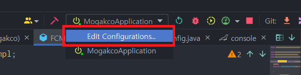
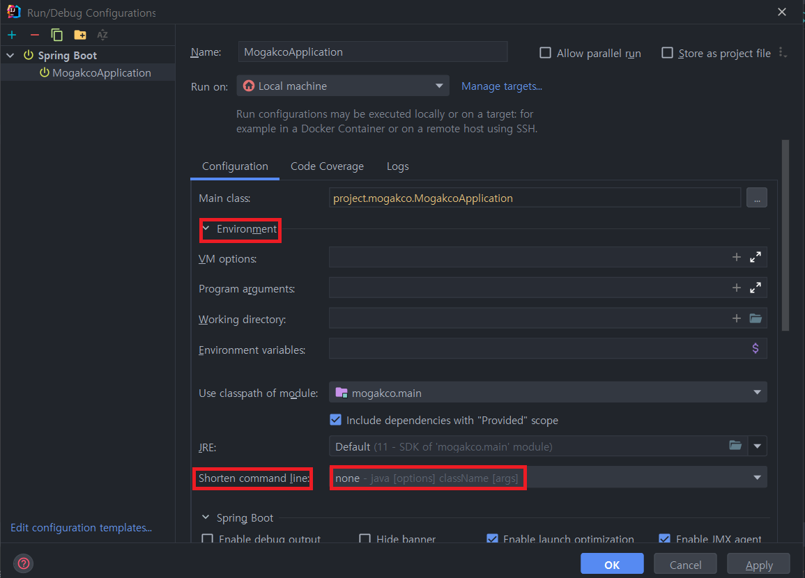

## 소개배경

> 💡 아래와 같은 이슈는 처음 겪는 타입의 에러여서 상당히 Trouble Shooting에 애를 먹었다.

```markdown
"C:\Program Files\Java\jdk-11.0.13\bin\java.exe" -XX:TieredStopAtLevel=1 -noverify -Dspring.output.ansi.enabled=always "-javaagent:C:\Program Files\JetBrains\IntelliJ IDEA 2021.2\lib\idea_rt.jar=60224:C:\Program Files\JetBrains\IntelliJ IDEA 2021.2\bin" -Dcom.sun.management.jmxremote -Dspring.jmx.enabled=true -Dspring.liveBeansView.mbeanDomain -Dspring.application.admin.enabled=true -Dfile.encoding=UTF-8 @C:\Users\이성호\AppData\Local\Temp\idea_arg_file298156041 project.mogakco.MogakcoApplication
Exception in thread "main" java.lang.NoClassDefFoundError: org/springframework/boot/SpringApplication
	at project.mogakco.MogakcoApplication.main(MogakcoApplication.java:19)
Caused by: java.lang.ClassNotFoundException: org.springframework.boot.SpringApplication
	at java.base/jdk.internal.loader.BuiltinClassLoader.loadClass(BuiltinClassLoader.java:581)
	at java.base/jdk.internal.loader.ClassLoaders$AppClassLoader.loadClass(ClassLoaders.java:178)
	at java.base/java.lang.ClassLoader.loadClass(ClassLoader.java:521)
	... 1 more
```

정말 어이없는 이슈였던 에러인 `NoClassDefFoundError` 덕에 프로젝트 개발이 약 3일 동안 지체된 경험을 겪게되었는데, 
혹시라도 나와 같이 사람들은 Trouble Searching에 시간을 너무 많이 쏟지 않기를 하는 바람으로 포스팅해본다.

## Trouble(문제 원인)
우선 `NoClassDefFoundError`가 발생하는 이유로는 여러 이유가 존재한다.

필자의 경우 Spring Application을 실행시에 해당문제가 발생하였고, 스프링에서 해당 문제가 발생하는 Case는 여러 경우가 존재한다.

1. Spring 환경을 구성해주는 (implementation 'org.springframework.boot:spring-boot-starter-web')이 없는 경우

2. 클래스 파일이 옳바르지 못한 위치 즉, classpath가 존재하지 않거나 파일이 존재하지 않을 경우

3. gradle에서의 의존성 충돌으로 인한 에러

크게 이 3가지 경우에 NoClassDefFoundError가 발생한다고 한다.

하지만, 내 Application class의 경로 문제는 아니었고, boot-starter 또한 존재하는 환경이었다.

그렇다면, 의심해야 할 가능성은 gradle 의존성 충돌로 에러가 발생했을 가능성이 제일 높았고, 에러가 발생한 시점이 마침 FCM 의존성을 추가한 이후 였기에 
이를 의심할 수 밖에 없었다.

하지만, FCM이 문제라고 생각했던 나는 gradle에서 의존성을 제거한 후에도 문제가 발생하자 Intellij의 설정문제인 것 같아 구글링을 하게되었다.

## 원인 파악
우선 위의 에러 이전에 우선적으로 났던 에러가 존재한다.


해당 이슈를 무시하고 Application을 강제 실행시켰을 때 NoClassDefFoundError가 발생했었다.

**"그렇기에 이 에러는 대체 뭐지?"** 라는 생각이 들어 찾아본 결과 자료가 없어도 너무 없었다.

하다 못해 StackOverFlow에서도 조차 나와 비슷한 사례를 찾기힘들었는데, 같은 환경은 아니었어도 Test 코드 작성 중에 나와 비슷한 에러를 겪은 사람의 블로그를 찾게되었다.

해당 블로그에는 `Command is too long` 에러를 파악해야한다고 적혀있었다.

그리고 이를 Gpt에게 물어보자 아래와 같은 답변을 얻을 수 있었다.

> 💻 GPT 답변 일부 
> 
> 스프링 부트는 내부적으로 클래스패스를 다룰 때 매우 긴 경로를 사용합니다.
> 
> 만약 Windows 운영체제에서 매우 긴 클래스패스를 사용하면 명령줄이 매우 길어지고 "Command is too long" 에러가 발생할 수 있습니다. 
> 
> 이는 Windows 운영체제에서 명령줄 길이에 대한 제한이 있기 때문입니다.

그렇다면 이 문제를 해결하기 위해선 클래스 패스를 스프링 프레임워크 내부에서 다루는 방법을 바꾸어 줘야했다.

참고로, 해당 문제를 Local에서만 발생하는 이슈인 것을 배포환경과 비교하여 파악했다.

## Trouble Shooting(문제 해결)
이를 해결하기 위해선 아래와 같은 방법을 사용하면 된다.

1. 

사진과 같이 Configuration을 설정할 수 있는 탭을 눌러 `Edit Configuration`을 클릭한다.

2. 

Configuration 탭 중 `Environment` 카테고리를 열어 `Shorten Command line`의 `none`을 `Jar Manifest`로 변경해준다.

해당 과정을 모두 거치고 실행을 한다면, 에러는 고쳐질 것이다.


### 🤔 이거한다고 어떻게 고쳐지는 거지?

아까 말헀듯 NoClassDefFoundError는 클래스패스가 옳바르지 못한 경우에 발생한다고 말했다.

그렇다면 FCM 종속성을 추가한 이후 발생한 **"Command is too long"** 에러의 경우와 맞물려 해당 에러가 일어났을 가능성이 크다.

FCM 추가 이후 라이브러리 파일이 빌드 파일에 추가되어 총 파일의 크기가 커져 "Command is too long" 에러를 유발한 것이다.

그리고 Configuration의 설정 값을 바꾼 것만으로 에러가 해결된 이유는 앞서말한 클래스 패스 때문이다.

Jar manifest로 변경할 경우, Gradle을 생성하는 Jar 파일 내부에 "Class-Path" 항목이 추가된다.

해당 항목은 JAR 파일 내에 포함된 다른 라이브러리 파일들을 가리키는 경로를 지정하는 역할을 수행하게 되는데, 이 경우 라이브러리 파일을 더 이상 커맨드라인으로 넘기지 않는다.
이전 에러 발생의 원인이 커맨드 라인 인수가 많아서 발생한 에러였기에 이를 해결할 수 있었다.

> 💡 참고
> 
> Shorten Command line의 설정 값을 None으로 설정한다면 라이브러리 파일들이 직접 커맨드 라인 인수로 지정된다.
> 
> 해당 경우에는 커맨드 라인 길이가 더 길어지기 때문에 시스템 환경에 따라 커맨드 라인 길이가 초과될 수 있다.

## 결론
Intellij 설정 값으로 인해, 고생한 경험은 개발 초기 말고 없었는데 이러한 이슈를 겪고 나니 세삼 IntelliJ는 설정이 정말 어렵다는걸 다시 한번 상기하는 계기가 되었다.