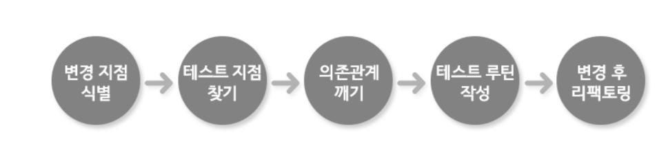

# 레거시 코드 (Legacy-Code)

코드의 가독성이 떨어지거나 기존의 규약없이 결합도가 높은 Dirty Code 들이 쌓이고 쌓여 화석처럼 굳어진 코드들을
`레거시 코드`라고 일커른다.

레거시 코드란 정의적으로는 다음과 같다.

> 테스트가 불가능하거나 기능이 정상적이지 않거나 가독성이 떨어지는 코드를 총칭적으로 일컫는 용어

## 레거시 코드의 특성

1. 코드의 수정이 어렵다.

=> 단위 테스트가 되어 있지 않기 때문에 한 기능을 수정하면 수정으로 인한 Side Effect를 예상하기 어렵다. 프로그램의 추가에 있어
예외적인 상황을 마주하거나 단순수정으로 인해 시스템이 전체적인 문제를 야기할 수 있다.

2. 코드를 이해하기 어렵다.

=> 코드의 리팩터링이 되어 있지 않아 흔히 말하는 스파게티 코드의 구조를 띄고 있기 때문에 코드의 흐름파악이 어렵다.

## 레거시 코드를 좋은 코드로 변경하는 방법

1. 변경 지점 식별

=> 변경시킬 지점을 파악하기 위해 전체적인 아키텍쳐를 파악하여 리팩터링할 지점을 파악.

2. 테스트 지점 찾기

=> 리팩터링이 필요한 부분을 찾았다면 메서드들에 대한 테스트 루틴을 작성할 부분을 결정한다. 이때 의존관계를 최소화한다.

3. 의존관계 깨기

=> 코드에서 의존관계를 없애야한다. 의존관계란 다른 클래스나 인터페이스에 방향성을 가지고 있는 코드를 얘기한다.
예를들어 A클래스가 B클래스에 있는 메소드를 호출하는 코드가 구현된 상태에서 A클래스가 변경되었다고 해서 B클래스까지 변경될
필요는 없다. 이를 A 클래스가 B클래스에 의존하고 있다고 칭한다.

이러한 의존관계는 코드의 유지보수성을 저하시키기에 최소화시켜야한다.

4. 테스트 루틴 작성

=> 테스트 루틴을 작성할 때에는 코드의 동작을 이해할 수 있도록 테스트를 작성.

5. 변경 후 리팩토링

=> 전체적으로 큰 단위의 메서드들을 세분화시켜 작은 메서드로 잘게 쪼개 메서드의 재사용성을 높이며 중복성을 제거한다.