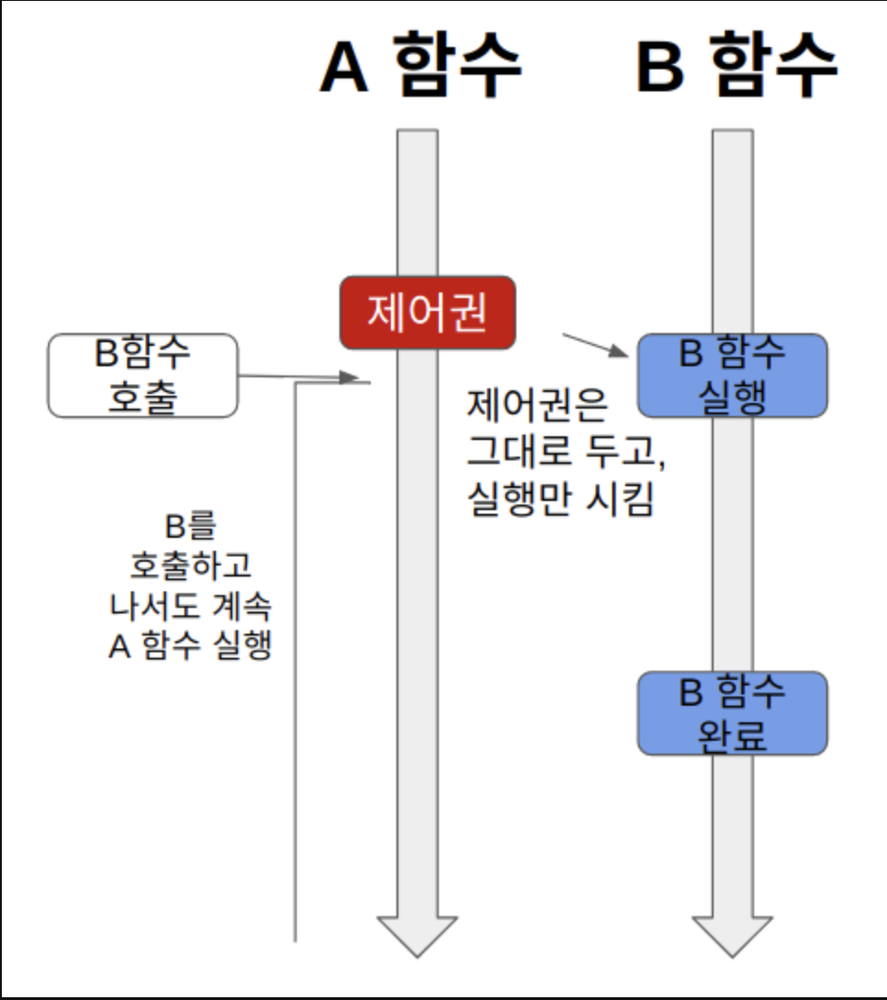
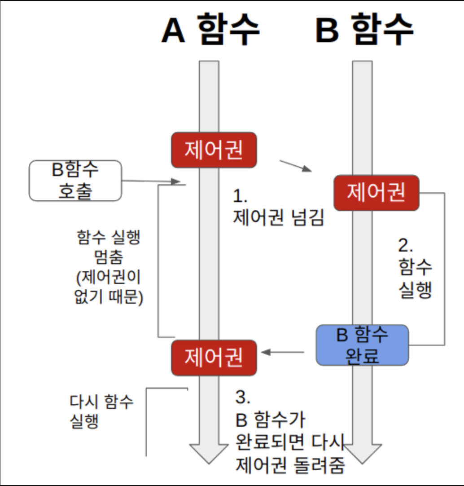

# 블로킹 vs 논블로킹, Sync vs Async.md
개발을 하다보면 가끔식 헷갈리는 개념들 중 하나인 블로킹(Blocking)과 논블로킹(Non-Blocking) 그리고 동기와 비동기 개념에 대해 확고하게 잡아보도록하자.

우선, 해당 개념들에 공통적으로 사용되는 용어가 있다.

바로 **제어권**과 **결과값의 반환**이다.

>💡용어 개념
> - 제어권
>   - 제어권이란 함수에 대한 실행 요청이 들어왔을 때 해당 코드를 실행할 권리이다.
>   - 제어권을 가진 함수는 자신의 코드를 모두 실행시키고 자신을 호출한 곳에 다시 권한을 반환한다.
> - 결과값의 반환
>   - A 함수에서 B 함수를 호출했을 때, A 함수가 B 함수의 결과값을 기다리느냐의 여부

## Blocking vs Non-Blocking
블로킹과 논블로킹의 개념 차이는 제어권의 차이에서 발생한다.

### Blocking

위 그림과 같이 최초실행된 **A 함수**에서 **B 함수**를 호출하는 작업이 발생한다고 가정해보자.

**`블로킹(Blocking)`**에서는 호출당한 함수가 자신의 코드를 전부 실행 시킨 후 다시 제어권을 돌려준다.

순서대로 정리해보자면 아래와 같다.

1. A함수에서 B함수를 호출할 때 B에게 제어권을 넘겨준다.
2. 제어권을 받은 B는 자신의 코드를 실행시키고 만약, 그 속에서도 다른 함수를 호출한다면 제어권을 넘겨준 후 실행이 끝나면 돌려받는다.
    - 이때 A는 자신의 제어권을 전달한 상태이기에 코드의 실행을 잠시 멈춘다.
3.B함수는 실행이 끝나면 자신을 호출한 A에게 제어권을 돌려준다
 
### Non-Blocking
논블로킹은 A함수가 B함수를 호출해도 제어권은 그대로 자신이 가지고 있는다.

1. A함수가 B함수를 호출하면, B 함수는 실행되지만, 제어권은 A 함수가 그대로 가지고 있는다.
2. A함수는 계속 제어권을 가지고 있기 때문에 B함수를 호출한 이후에도 자신의 코드를 계속 실행한다.

## Synchronous(동기) vs ASynchronous(비동기)
동기와 비동기의 차이는 호출되는 함수의 작업 완료 여부를 신경쓰는지의 여부이다.

### Synchronous
함수 A가 함수 B를 호출한 뒤, 함수 B의 **반환 값**을 대기하며 체크하는 것이 특징

### ASynchronous
함수 A가 함수 B를 호출 할 때 **콜백 함수를 함께 전달**하여 함수 B의 코드 실행이 완료되면 콜백함수를 실행

결과적으로 동기와 달리 반환값의 상태는 영향을 끼치지 않음

## 종합비교
여기서 대부분의 개발자들이 동기와 블로킹의 개념을 혼동한다.

정확히는 다르지만, 얼추 비슷한 부분이 있기 때문이다.

하지만 이는 혼합될 수 있는 개념이지 같은 개념이 아니기에 각 개념들을 혼합한 상황을 살펴보자

## Sync-Blocking

1. 함수 A는 함수 B의 반환 값을 필요로한다.(동기)
2. 그래서 제어권을 함수 B에게 넘겨주고, 함수 B가 실행을 완료하여 리턴값과 제어권을 돌려줄때까지 기다린다(블로킹)

## Sync-Nonblocking

논블로킹과 동기 즉, 각각의 함수는 별도로 실행이 되는 상태이지만 A함수에서는 B함수의 작업이 종료되었는지 계속해서 확인하는 작업을 수행한다.

1. B함수를 호출하고 자신의 함수는 계속해서 수행한다.(논블로킹)
2. A함수는 B의 반환값이 필요하기에 계속해서 캐치를 시도(동기)

웹 소켓에서 이를 폴링(Polling) 방식이라고 칭한다.

해당방법은 기본적으로 상당히 리소스를 많이 잡아먹게된다.
외에도 A함수가 먼저 실행이 종료돠어도 B함수의 결과가 반환될 때까지 기다려야한다는 점에서 효율성이 좋지 못하고 이로 인한 서버 부하 또한 고려사항이다.

## Async-NonBlocking
비동기 + 논블로킹은 상당히 간단하다.

1. 자신의 제어권을 넘기지 않고 B함수를 실행시킴과 동시에 콜백함수를 B함수에게 전달한다.(논블로킹)
2. B함수는 자신의 코드 수행이 끝난후 콜백함수를 실행한다.(비동기)

## Async-Blocking
잘 발생하지 않는 구조이며, 논리적으로도 부합하지 않는구조이다.

기본적으로 동기와 블로킹의 경우 B함수의 의존적 또는 관계적인 성향이다.

**하지만 이를 비동기와 함께 사용한다?** 이는 조금 어불성설적인 구조이다.

1. A함수는 B함수의 실행결과(반환 값)와 상관없이 콜백함수를 전달한다.(비동기)
2. 하지만 B함수의 반환 값을 실행쓰지 않는 것과 달리 제어권을 B함수에게 넘긴다(블로킹)

## 결론
정말 개발을 하다보면, 여러 구조의 프레임워크나 라이브러리를 다뤄야할 때가 많고, 해당 구조를 옳바르게 사용하기 위해선
설계된 구조에 맞추어 코드를 작성하는 것이 옳바르게 사용하는 법이라고 생각한다.

하지만, 가끔씩 해당 개념들이 흔들리다 보면 비효율적인 코드 구조를 나아내기도 하기에 이러한 개념은 견고하게 붙잡아야겠다.